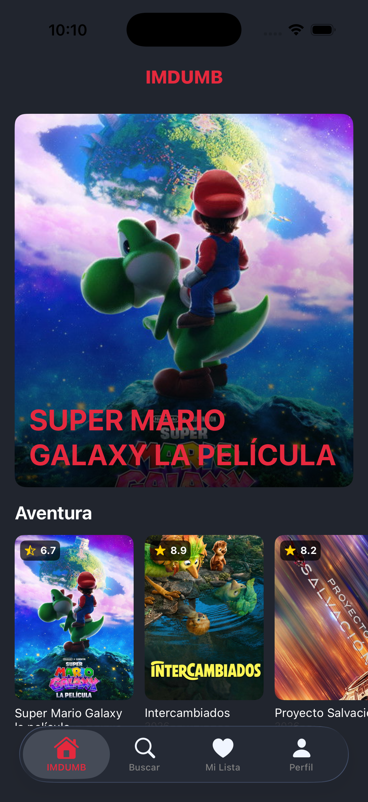
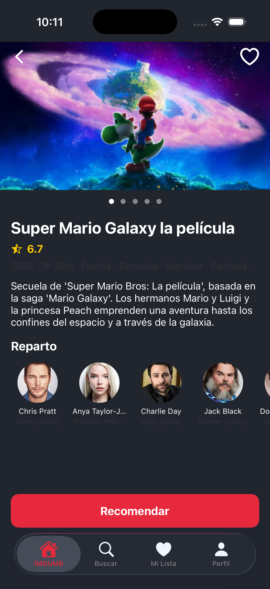
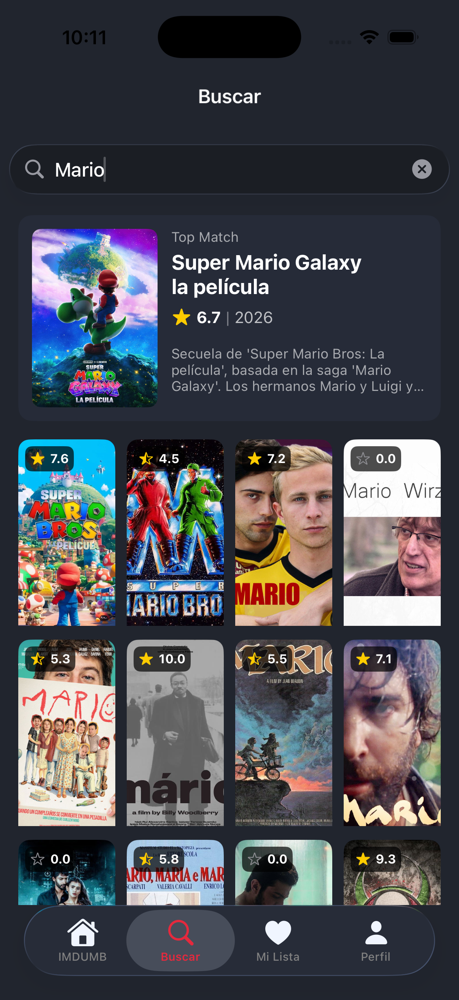
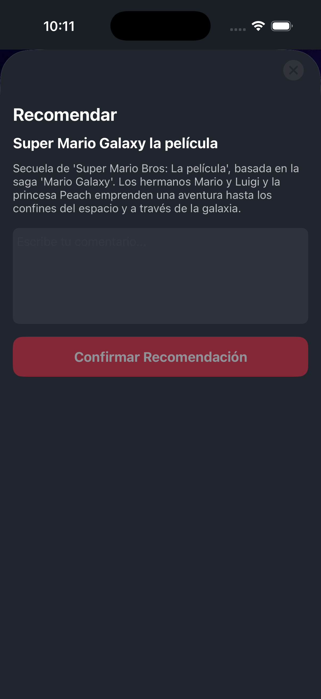
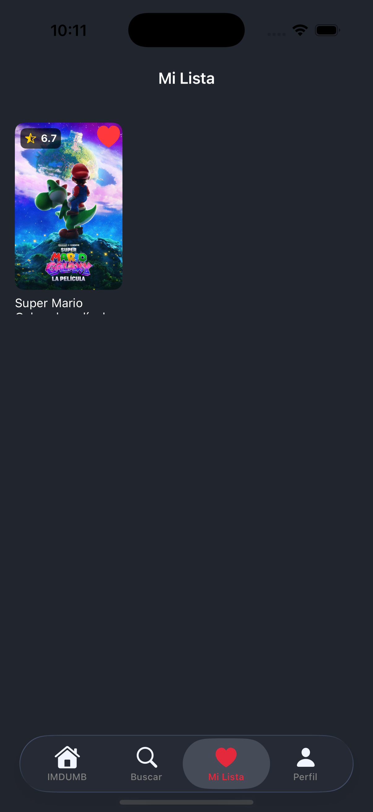
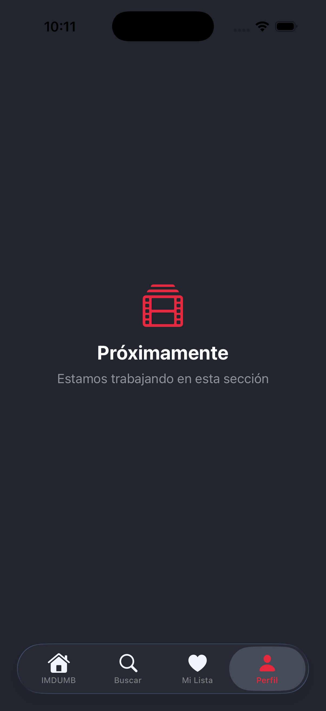
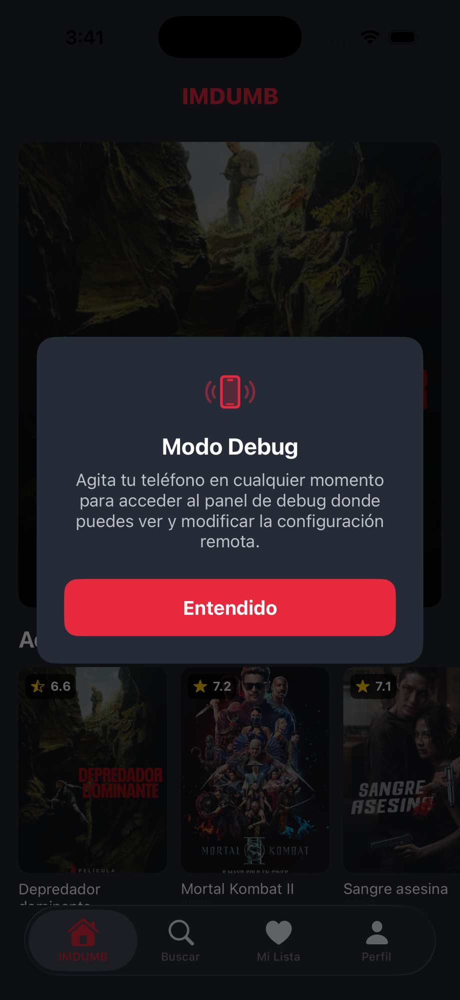

# IMDUMB

Aplicacion iOS para explorar peliculas, construida con **MVP + Clean Architecture + Coordinator Pattern**.

## Screenshots

| Home | Detail | Search |
|:---:|:---:|:---:|
|  |  |  |
| Pelicula destacada y carruseles por categoria | Carrusel de imagenes, reparto y boton recomendar | Busqueda en tiempo real con top match y grilla |

| Recommend | Favorites | Profile |
|:---:|:---:|:---:|
|  |  |  |
| Modal para guardar recomendacion con comentario | Grilla de peliculas favoritas con opcion de eliminar | Proximamente — seccion en desarrollo |

| Debug Mode |
|:---:|
|  |
| Agita el telefono para acceder al panel de configuracion remota (solo en Dev) |

## Arquitectura

```
Presentation (View + Presenter + Coordinator + Builder)
       |
    Domain (UseCases + Entities + Repository Protocols)
       |
    Data (Repositories + DTOs + Mappers + DataSources)
       |
 Infrastructure (Remote + Mock + Firebase + CoreData)
```

### Reglas por capa

- **View** solo se comunica con **Presenter** mediante protocolos. La View es pasiva.
- **Presenter** mantiene una referencia weak a la View. Nunca importa UIKit.
- **UseCase** se comunica con Repository via protocolo. Solo Swift puro.
- **Repository** vive en la capa Data. Se comunica con DataSources via protocolo.
- **La capa Domain tiene CERO dependencias** de cualquier otra capa o framework.
- **Los DTOs nunca salen de la capa Data**. Siempre se mapean a Entities.

### Patron de ensamblaje por pantalla

Cada pantalla tiene 5 archivos + XIB:

| Archivo | Rol |
|---------|-----|
| `{Screen}Protocols.swift` | Definicion de protocolos View + Presenter, ViewModels como structs |
| `{Screen}Presenter.swift` | Logica de negocio, referencia weak a View |
| `{Screen}ViewController.swift` | Vista UIKit, conforma ViewProtocol |
| `{Screen}ViewController.xib` | Layout (obligatorio — sin UI programatica) |
| `{Screen}Builder.swift` | Factory, conecta Presenter con View |
| `{Screen}Coordinator.swift` | Navegacion, creado desde el coordinator padre |

### Inyeccion de dependencias

`DIContainer` (manual, sin framework) contiene singletons lazy para network/dataSources/repositories y metodos factory (`make*UseCase()`) para use cases. Los Presenters reciben repositorios directamente para acceso a datos. Se pasa a traves de coordinators hacia los builders.

## Stack Tecnologico

- **Swift 5.9** + **UIKit** con archivos `.xib` (sin Storyboards, sin SwiftUI, sin UI programatica)
- **iOS 15.0+**
- **MVP + Clean Architecture + Coordinator Pattern**
- **Sin CocoaPods** — todas las dependencias via SPM

## Requisitos

- Xcode 15.0+
- iOS 15.0+
- Swift 5.9

## Configuracion

```bash
git clone git@github.com:donnadony/imdumb.git
cd imdumb
open imdumb.xcodeproj
```

1. Xcode resuelve las dependencias SPM automaticamente al abrir el proyecto
2. Seleccionar esquema `IMDUMB` (Dev) o `IMDUMB-Dev`
3. Seleccionar un simulador (iPhone 15 o superior)
4. Compilar y ejecutar (`Cmd+R`)

> No se usa CocoaPods. Todas las dependencias se gestionan via Swift Package Manager.
> `GoogleService-Info.plist` esta incluido para fines de evaluacion.

## Dependencias (SPM)

| Paquete | Uso |
|---------|-----|
| **Alamofire** | Cliente HTTP para consumo de TMDB API |
| **Kingfisher** | Carga y cache de imagenes |
| **Firebase iOS SDK** | RemoteConfig para feature flags |

## Persistencia

- **CoreData**: `FavoriteEntity` para peliculas favoritas, `RecommendationEntity` para recomendaciones de peliculas
- **UserDefaults**: Flags simples y configuracion de la app (`AppSettings`)
- **Firebase RemoteConfig**: Feature flags remotos (ej. `show_recommendations` controla la visibilidad del boton Recomendar)

## Data Sources y Mocking

El proyecto implementa tres variantes de `MovieDataSourceProtocol` para diferentes entornos:

| DataSource | Descripcion |
|------------|-------------|
| `RemoteDataSource` | Consume la TMDB API via Alamofire (produccion) |
| `LocalDataSource` | Lee datos desde UserDefaults (cache local) |
| `MockDataSource` | Usa JSON incluido en el bundle (tests y QA manual) |

Para cambiar de data source, modificar la instancia en `DIContainer`. Esto permite ejecutar la app offline sin cambios en presenters ni repositorios.

## API

Usa TMDB API (https://api.themoviedb.org/3)

| Endpoint | Descripcion |
|----------|-------------|
| `GET /genre/movie/list` | Obtener generos/categorias de peliculas |
| `GET /discover/movie?with_genres={id}` | Obtener peliculas por genero |
| `GET /movie/{id}?append_to_response=credits,images` | Obtener detalle de pelicula con reparto e imagenes |
| `GET /search/movie?query={query}` | Buscar peliculas por titulo |

## Pantallas

| Pantalla | Tab | Funcionalidades |
|----------|-----|-----------------|
| Splash | — | Carga RemoteConfig, muestra mensaje de bienvenida |
| Home | IMDUMB | Pelicula destacada, carruseles por categoria, pull-to-refresh, badges de favorito/recomendado en tarjetas |
| Search | Buscar | Busqueda en tiempo real con debounce, tarjeta top match, grilla de resultados con badges |
| Detail | — | Carrusel de imagenes, reparto, lista de recomendaciones, toggle de favorito, boton recomendar |
| Recommend | — | Modal (formSheet), guardar comentario de recomendacion en CoreData |
| Favorites | Mi Lista | Grilla de peliculas favoritas, tap en corazon para eliminar, tap en tarjeta para ir al detalle |
| Profile | Perfil | Configuracion del usuario |

## Navegacion

`AppCoordinator` es dueño del window. Despues del splash, configura un `UITabBarController` con 4 tabs (Home, Buscar, Mi Lista, Perfil). 
Cada tab tiene su propio `UINavigationController` y `Coordinator`. Los coordinators hijos manejan push/present dentro de su navigation stack.

## Testing

Tests unitarios para presenters, use cases y mappers. Ejecutar con `Cmd+U` o `xcodebuild test`.
